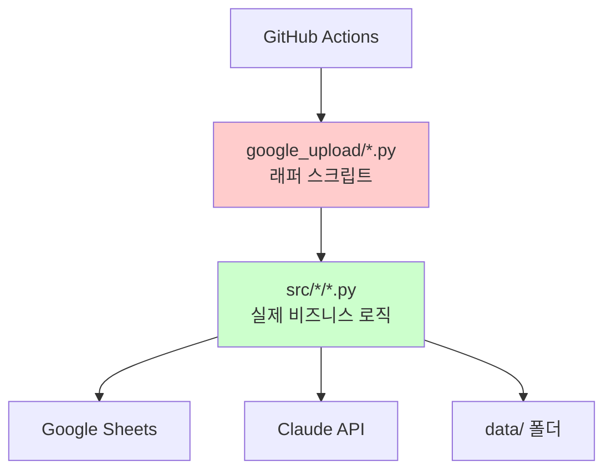

# 프로젝트 구조 및 실행 흐름

## 현재 아키텍처 (2025.05)

## 파일별 역할

| 파일 경로 | 역할 | 실제 코드 위치 |
|-----------|------|----------------|
| google_upload/news_scraper.py | 래퍼 | src/scrapers/news_scraper.py |
| google_upload/upload_to_sheets.py | 래퍼 | src/uploaders/sheets_uploader.py |
| google_upload/daily_filter_and_expand_claude.py | 래퍼 | src/processors/daily_summary.py |
| google_upload/real_estate_insight.py | 래퍼 | src/processors/real_estate_insight.py |
| google_upload/weekly_summary.py | 래퍼 | src/processors/weekly_summary.py |

## 주의사항
- 래퍼는 수정하지 말 것
- 실제 로직은 src/ 폴더에서만 수정
- 새 기능은 src/ 아래에 추가
